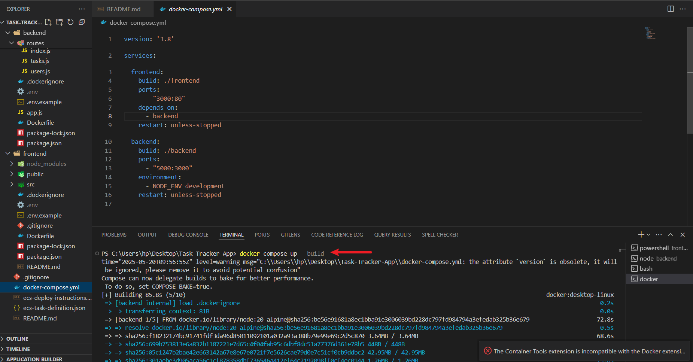

# Task Tracker App

## Project Structure

- `frontend/`: React app
- `backend/`: Node.js (Express) API

## Local Development with Docker Compose

1. Copy `.env.example` to `.env` in both `frontend` and `backend` folders and adjust as needed.
2. Build and start the services:

   ```powershell
   docker compose up --build
   ```
   

- Frontend: <http://localhost:3000>
- Backend API: <http://localhost:5000>

## Deployment Instructions

### Local Deployment with Docker Compose

1. Copy `.env.example` to `.env` in both `frontend` and `backend` folders and adjust as needed.
2. Build and start the services:

   ```bash
   docker compose up --build
   ```

- Frontend: [http://localhost:3000](http://localhost:3000)

   

- Backend API: [http://localhost:5000](http://localhost:5000)

   

- Prometheus: [http://localhost:9090](http://localhost:9090)

   

- Grafana: [http://localhost:3001](http://localhost:3001)

   

### Monitoring Setup

#### Using Grafana Provisioning Folder

1. **Pre-configured Dashboards**:
   - The `grafana-provisioning` folder contains pre-configured dashboards and data sources.
   - Dashboards are located in `grafana-provisioning/dashboards/`.
   - Data sources are located in `grafana-provisioning/datasources/`.

2. **Steps to Import Dashboards**:
   - Place the `grafana-provisioning` folder in the Grafana container's `/etc/grafana/provisioning/` directory.
   - Restart the Grafana container to automatically load the dashboards and data sources.

3. **Access Dashboards**:
   - Navigate to Grafana and view the imported dashboards under the title "Backend Metrics" or other configured titles.

   
   
   

## CI/CD Pipeline Setup

### Steps to Build CI Pipeline Using GitHub Actions

1. **Create Dockerfiles**:
   - Ensure Dockerfiles are present for both `frontend` and `backend`.

2. **Set Up Docker Compose**:
   - Use `docker-compose.yml` for local development.

3. **Create GitHub Actions Workflow**:
   - Add a `.github/workflows/ci.yml` file to your repository.
   - Example workflow:

     ```yaml
     name: CI Pipeline

     on:
       push:
         branches:
           - main
       pull_request:
         branches:
           - main

     jobs:
       build:
         runs-on: ubuntu-latest

         steps:
           - name: Checkout code
             uses: actions/checkout@v3

           - name: Set up Docker
             uses: docker/setup-buildx-action@v2

           - name: Build and push backend image
             run: |
               docker build -t backend ./backend

           - name: Build and push frontend image
             run: |
               docker build -t frontend ./frontend

           - name: Run tests
             run: |
               docker-compose run backend npm test
               docker-compose run frontend npm test
     ```

4. **Run the Pipeline**:
   - Push changes to the `main` branch to trigger the pipeline.

5. **Verify CI Pipeline Logs**:
   - Check the GitHub Actions tab in your repository for pipeline logs.

   

### Deliverables

1. **GitHub Repository**:
   - Ensure the repository contains:
     - Dockerfiles for `frontend` and `backend`.
     - `docker-compose.yml` for local development.
     - `.github/workflows/ci.yml` for the CI pipeline.

2. **Deployment Link**:
   - Provide the link to the deployed application (e.g., AWS Load Balancer DNS).

3. **CI Pipeline Logs or Screenshots**:
   - CI/CD pipeline with GitHub Actions
  [](https://github.com/franklynux/Task-Tracker-App/actions/workflows/ci.yml)

   

4. **Monitoring Setup**:
   - Ensure Prometheus and Grafana are configured and accessible.

   
   
   
